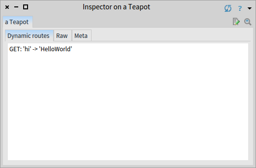
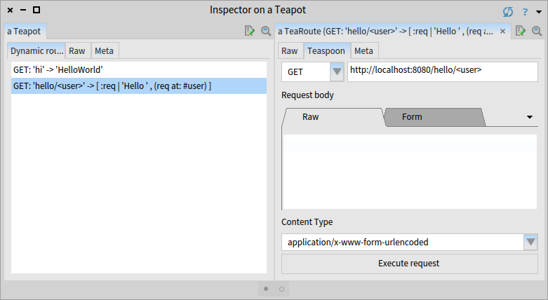
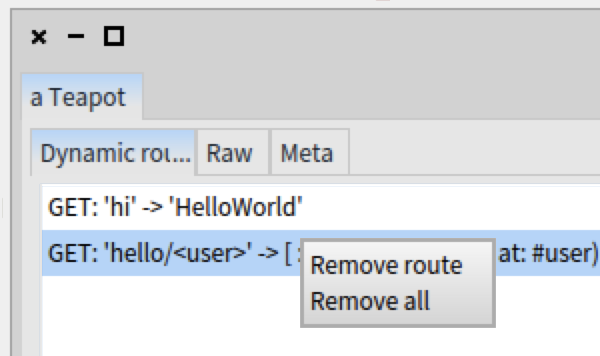

# Tealight

**Tealight** is a project defining a few extensions to the **Teapot framework** to make the (tea) time you spend with the [Pharo](http://www.pharo.org) Teapot system even easier. 


Install
---------
You can install **Tealight** by executing the following load scripts:

```Smalltalk
Metacello new 
	repository: 'github://astares/Tealight/repository';
	baseline: 'Tealight';
	load 	
```	
	
Alternatively you can install **Tealight** also from the [Pharo catalog](http://catalog.pharo.org) using the *Catalog Browser* right from within your Pharo image.

Basic Usage
---------

### Working with the Tealight server
After you have the framework installed you can easily start a **Tealight** web server by selecting

 _"Tealight"_ -> _"WebServer"_ -> _"Start webserver"_

from the Pharo world menu. Internally this starts a Teapot server with some defaults.

You can also easily stop the server from the Tealight web server menu by using _"Stop webserver"_ or open a webbrowser on the server by using _"Browse"_.

### Accessing the default Teapot
After you started the server you can easily access the running Teapot instance from your code or playground

```Smalltalk
TLWebserver teapot
```

You can easily experiment with Teapot routes, for instance using

```Smalltalk
TLWebserver teapot 
	GET: '/hi' -> 'HelloWorld'
```

If you point your browser to [http://localhost:8080/hi]() you will receive your first "HelloWorld" greeting.

If you open an inspector on the Teapot instance 

```Smalltalk
TLWebserver teapot inspect
```

you will see that a dynamic route was added:



So you can dynamically add new routes for GET, POST, DELETE or other HTTP methods interactively.

We recommend to read the [Teapot chapter of the Pharo Enterprise Book](https://ci.inria.fr/pharo-contribution/job/EnterprisePharoBook/lastSuccessfulBuild/artifact/book-result/Teapot/Teapot.html) to get a better understanding of the possibilities of the underlying **Teapot** framework.

Experimenting
---------

### Experimenting with Dynamic Routes

Lets add another dynamic route on our default Teapot, this time a dynamic route with a block as an action.
The block itself receives the request as an argument:

```Smalltalk
TLWebserver teapot 
	GET: '/hello/<user>' -> [:req | 'Hello ', (req at: #user)]
```

You can now use your web browser again to call the newly defined URL. This time you need to give a parameter when you point the webbrowser to the new URL. 

[http://localhost:8080/hello/Pharo]()  returns **Hello Pharo** while

[http://localhost:8080/hello/Smalltalk]()  returns **Hello Smalltalk** 

### Introduction to Teaspoon

There is a new tool called **Teaspoon** that was added as a custom inspector tool on dynamic routes by Attila Magyar. Attila is the author of Teapot. Let's see how we can access this nice tool.

First inspect our Teapot instance again 

```Smalltalk
TLWebserver teapot inspect
```

but this time click on the dynamic route that we added lately in the displayed list of dynamic routes. The inspector will navigate into another inspector displaying the dynamic route instance. There is a second custom tab extension in this inspector called "Teaspoon":



In this inspector tool you see the HTTP method (here **GET**) and the full URL of your dynamic route. You can change the URL by replacing _<user>_ with your name and click on _"Execute Request"_.

This will perform the request and display the result in the inspector again. So you can interactively test your routes right from within your Pharo image without switching to external tools.

The **Teaspoon** tool is especially useful when you experiment with route patterns or if you want to define, implement and test a REST based API with Pharo.

### Cleaning up

If you (by accident) messed up with a single route defintion during your experiments the context menu in the inspector comes to the rescue:





to delete a single route or all routes. You can even clean up via script:

```Smalltalk
TLWebserver teapot 
	removeAllDynamicRoutes 
```

For the next part of this tutorial lets remove all defined routes.

Defining a REST based interface
---------

### REST API in annotated methods

While it is nice to experiment with dynamic routes by adding them one by one to the Teapot instance it would be even more convinient 

 * if we could define the REST API using regular Smalltalk methods
 * if we could map each URL easily

To support that ***Tealight*** adds a special utility class (called _TLRESTAPIBuilder_) to help you easily build an API. Lets see how we can use it.

First of all we need to create a simple class in the system either from the browser or with an expression:

```Smalltalk
Object subclass: #ExampleRESTAPI
	instanceVariableNames: ''
	classVariableNames: ''
	package: 'MyApp-REST-API'
```	

Now we can define a class side method:

```Smalltalk
greeting: aRequest
	<REST_API: 'GET' pattern: 'hello'>
	
	^'HelloWorld from Pharo'
```	

Now we can use the utility class to generate the dynamic routes for us:

```Smalltalk
TLRESTAPIBuilder buildAPI 
```	
